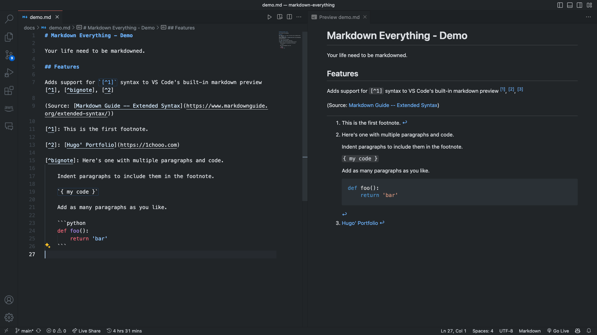

# ***Markdown Everything***

<h3 align="center">
    <b><i>Your life need to be markdowned.</i></b>
</h3>

    <i>✍️ A Solution to enhance MARK everything DOWN in <a href="https://code.visualstudio.com/">VSCode</a>!</i>

## Features

### Footnotes

Adds support for `[^1]` syntax to VS Code's built-in markdown preview.

### Convert to PDF

Incoming feature to convert markdown to PDF.

## CONTACT INFO.

> **Hugo ChunHo Lin**
> 
> <aside>
>   📩 E-mail: <a href="mailto:hugo970217@gmail.com">hugo970217@gmail.com</a>
>  
>   🧳 Linkedin: <a href="https://www.linkedin.com/in/1chooo/">Hugo ChunHo Lin</a>
>  
>   👨🏻‍💻 GitHub: <a href="https://github.com/1chooo">1chooo</a>
>    
> </aside>

## License
Released under [Apache License](./LICENSE) by [Hugo ChunHo Lin](https://github.com/1chooo).

This software can be modified and reused without restriction.
The original license must be included with any copies of this software.
If a significant portion of the source code is used, please provide a link back to this repository.

**Enjoy!** 
